# ARCDIS — System Architecture

Complete architecture documentation for ARCDIS. Every diagram and description below reflects the actual implementation in the codebase.

---

## Table of Contents

- [System Overview](#system-overview)
- [Component Responsibilities](#component-responsibilities)
- [Agent Internal Architecture](#agent-internal-architecture)
- [Authentication Flow](#authentication-flow)
- [Agent Registration Flow](#agent-registration-flow)
- [Heartbeat Flow](#heartbeat-flow)
- [Detection & Response Pipeline](#detection--response-pipeline)
- [Attack Reporting Pipeline](#attack-reporting-pipeline)
- [eBPF Detection Path](#ebpf-detection-path)
- [Cron Detection Path](#cron-detection-path)
- [Filesystem Detection Path](#filesystem-detection-path)
- [Backend Architecture](#backend-architecture)
- [Database Architecture](#database-architecture)
- [Frontend Architecture](#frontend-architecture)
- [Degraded Mode Behaviour](#degraded-mode-behaviour)
- [Offline Detection](#offline-detection)
- [Data Flow Summary](#data-flow-summary)

---

## System Overview

ARCDIS is composed of three independently deployable components that communicate over HTTP REST:

```
┌──────────────────────────────────────────────────────────────────┐
│                        Linux Endpoint                             │
│                                                                    │
│   ┌────────────────────────────────────────────────────────────┐  │
│   │                     ARCDIS Agent                           │  │
│   │                                                            │  │
│   │  ┌─────────────┐  ┌──────────────┐  ┌─────────────────┐  │  │
│   │  │   Monitor   │  │ EBPFMonitor  │  │    Reporter     │  │  │
│   │  │ (userspace) │  │ (kernel BPF) │  │ (heartbeat +    │  │  │
│   │  │  2s loop    │  │  perf buf    │  │  event queue)   │  │  │
│   │  └──────┬──────┘  └──────┬───────┘  └────────┬────────┘  │  │
│   │         │                │                    │           │  │
│   │  ┌──────▼────────────────▼──────────┐         │           │  │
│   │  │   LocalAnomalyDetector           │         │           │  │
│   │  │   IsolationForest × 5            │         │           │  │
│   │  │   + RiskEvaluator                │         │           │  │
│   │  │   + PolicyEngine                 │         │           │  │
│   │  │   + Preventer                    │         │           │  │
│   │  └──────────────────────────────────┘         │           │  │
│   └────────────────────────────────────────────────┼───────────┘  │
└────────────────────────────────────────────────────┼─────────────┘
                                                      │
                                              HTTP REST API
                                                      │
                          ┌───────────────────────────▼──────────────────────┐
                          │              FastAPI Backend                      │
                          │  ┌──────────┐ ┌──────────┐ ┌──────────────────┐ │
                          │  │/api/auth │ │/api/users│ │  /api/agents      │ │
                          │  └──────────┘ └──────────┘ │  /api/attacks     │ │
                          │                             └──────────────────┘ │
                          │  Background task: _mark_offline_loop (60s)       │
                          └───────────────────────────┬──────────────────────┘
                                                       │
                                                    Motor
                                                       │
                                              ┌────────▼───────┐
                                              │    MongoDB      │
                                              │  arcdis_db      │
                                              │  ├── users      │
                                              │  ├── agents     │
                                              │  └── attacks    │
                                              └────────┬────────┘
                                                       │
                                                  Axios (REST)
                                                       │
                          ┌────────────────────────────▼─────────────────────┐
                          │           React Dashboard (SPA)                   │
                          │  Public: Landing, Features, Architecture,         │
                          │          Security, Docs                           │
                          │  Auth:   Dashboard, Agents, AgentDetail,          │
                          │          Attacks, DownloadAgent                   │
                          └──────────────────────────────────────────────────┘
```

---

## Component Responsibilities

| Component | Language | Runtime | Primary Responsibility |
|---|---|---|---|
| Agent | Python 3.11+ | Linux root / systemd | Endpoint monitoring, ML inference, prevention |
| Backend | Python 3.11+ | Any OS, Uvicorn ASGI | REST API, authentication, data persistence |
| Dashboard | JavaScript (React) | Browser | Visualisation, user management, agent deployment |
| MongoDB | — | Any OS | Persistent storage for users, agents, attacks |

---

## Agent Internal Architecture

The agent entry point (`agent.py`) orchestrates three subsystems in a fixed startup sequence:

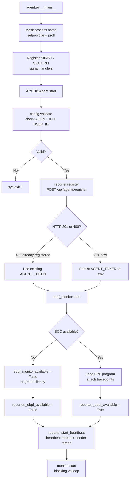

### Subsystem Startup Order (Critical)

The startup sequence in `agent.py` is ordered deliberately:

1. **Config validation** — fails fast if `AGENT_ID` or `USER_ID` are missing
2. **Registration** — must happen before heartbeat so the token exists
3. **eBPF start** — must happen before heartbeat so the degraded flag is set correctly
4. **Reporter._ebpf_available flag** — set after eBPF start, before heartbeat starts
5. **Heartbeat thread** — started with the correct online/degraded state
6. **Monitor loop** — blocking; runs until shutdown signal

---

## Authentication Flow

ARCDIS uses two separate authentication mechanisms depending on the caller.

### User Authentication (Dashboard → Backend)

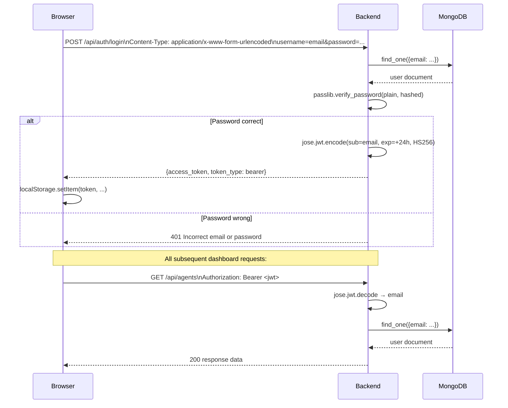

### Agent Authentication (Two-Phase)

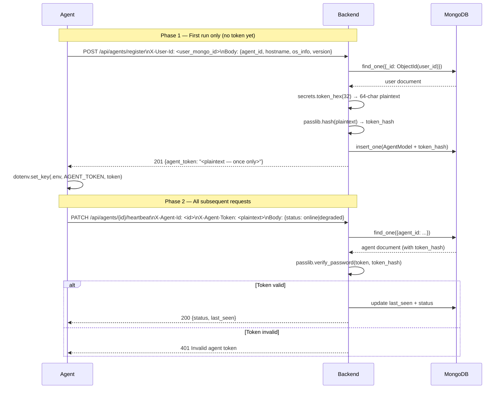

---

## Agent Registration Flow

Registration is initiated by `reporter.register()` on every agent startup.

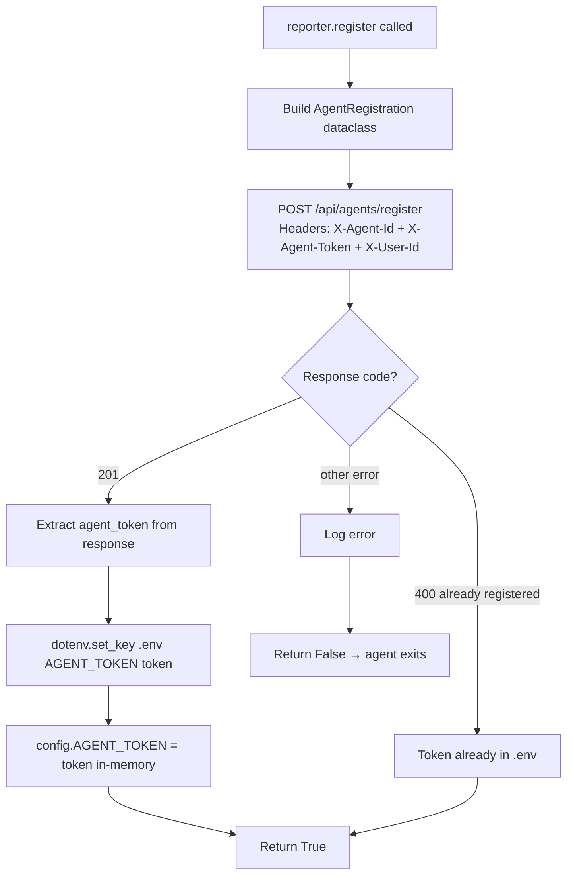

---

## Heartbeat Flow

The heartbeat runs in a background daemon thread every 30 seconds.

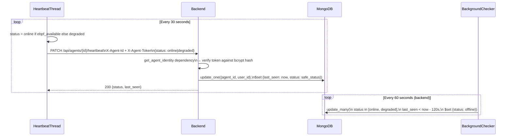

**Status clamping:** The backend only accepts `online` or `degraded`. Any other value is silently set to `online`. This prevents a misbehaving agent from writing arbitrary strings to the database.

---

## Detection & Response Pipeline

The main detection loop is the critical path for ARCDIS. All detection happens in `monitor.py` (userspace) and `ebpf_monitor.py` (kernel).

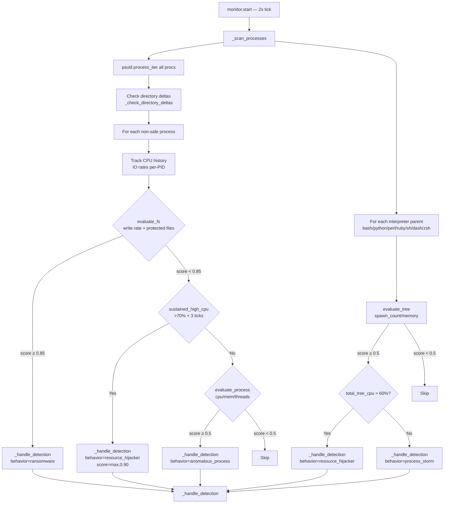

### _handle_detection Internal Flow

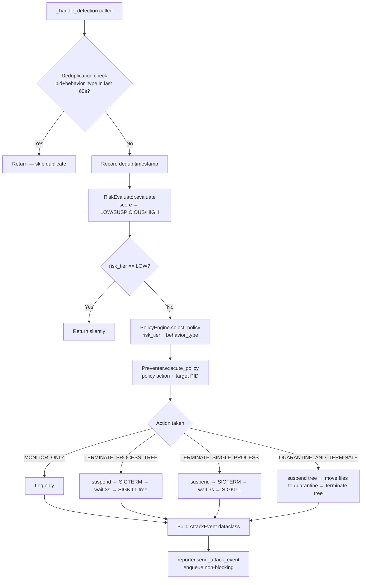

---

## Attack Reporting Pipeline

Attack reporting is fully decoupled from the detection loop via a thread-safe queue.

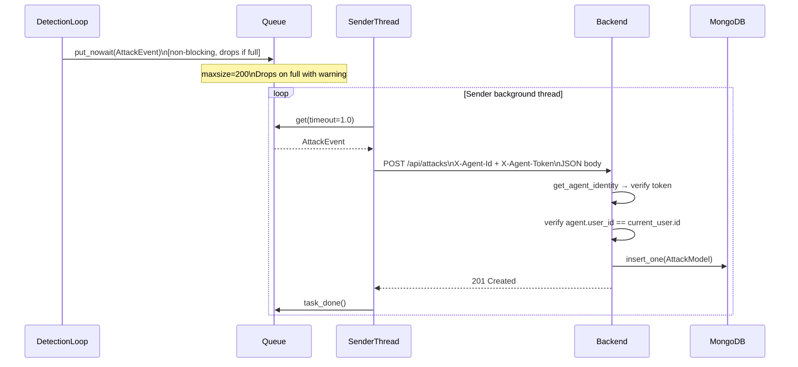

---

## eBPF Detection Path

The eBPF monitor runs entirely in a background thread and triggers independently of the userspace monitor.

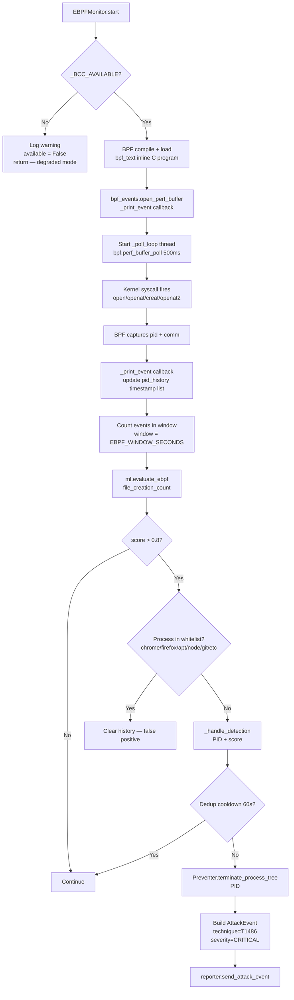

---

## Cron Detection Path

Cron scanning runs every 45 seconds within the main monitor loop.

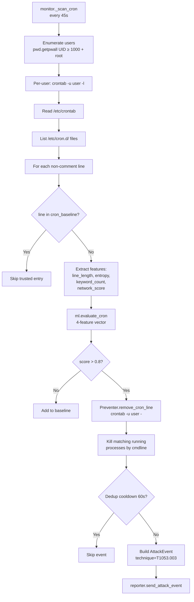

**Shannon entropy formula** is used for cron line analysis. High entropy (> 5.5) indicates base64-encoded payloads and is an automatic 0.95 score boost regardless of ML output.

---

## Filesystem Detection Path

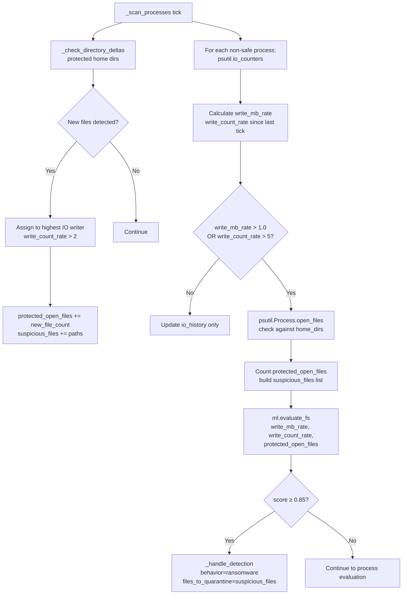

---

## Backend Architecture

The FastAPI backend uses a lifespan context manager to manage MongoDB connections and background tasks.

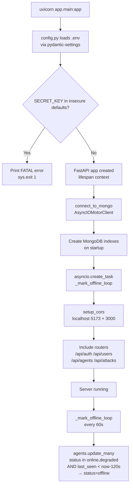

### Route Groups

| Prefix | Router | Auth Required |
|---|---|---|
| `/api/auth` | `auth.py` | None |
| `/api/users` | `users.py` | JWT Bearer |
| `/api/agents` | `agents.py` | Mixed (see below) |
| `/api/attacks` | `attacks.py` | Mixed (see below) |

**Mixed auth on `/api/agents`:**
- `POST /api/agents/register` → `get_registration_identity` (X-User-Id header only)
- `GET /api/agents`, `GET /api/agents/{id}`, `GET /api/agents/download` → `get_current_user` (JWT Bearer)
- `PATCH /api/agents/{id}/heartbeat` → `get_agent_identity` (X-Agent-Id + X-Agent-Token)

**Mixed auth on `/api/attacks`:**
- `POST /api/attacks` → `get_agent_identity` (X-Agent-Id + X-Agent-Token)
- `GET /api/attacks`, `GET /api/attacks/{id}` → `get_current_user` (JWT Bearer)

---

## Database Architecture

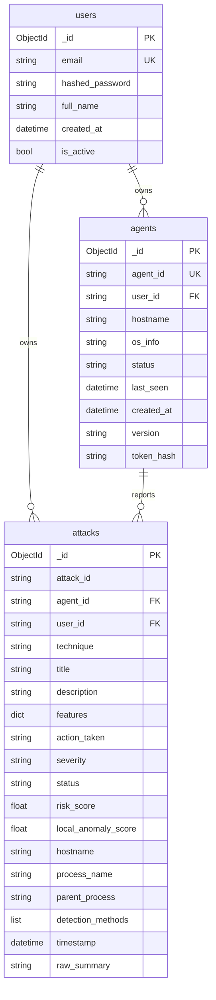

**Multi-tenant isolation:** Every query for agents or attacks includes `{"user_id": str(current_user["id"])}` in the filter. This is enforced at the route handler level, not via middleware, ensuring that even if a user guesses a valid `agent_id` or `attack_id`, they cannot retrieve records belonging to another user.

---

## Frontend Architecture

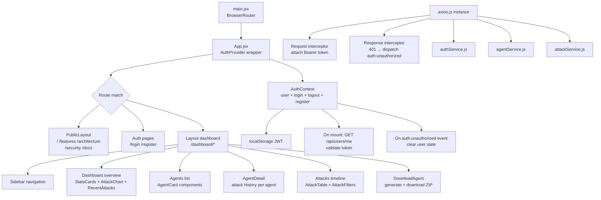

---

## Degraded Mode Behaviour

When `python3-bpfcc` is not available or the BPF program fails to compile:

```
Agent startup
    ↓
EBPFMonitor.start()
    ↓
try: from bcc import BPF
    ↓
ImportError OR BPF load exception
    ↓
ebpf_monitor.available = False
ebpf_monitor.running = False
LOG: "BCC not installed. Agent running in degraded mode."
    ↓
agent.py: reporter._ebpf_available = False
    ↓
Heartbeat sends: { "status": "degraded" }
    ↓
Backend stores: agents.status = "degraded"
    ↓
Dashboard shows: status = "Degraded" (amber/warning colour)
    ↓
Userspace monitoring (Monitor) continues normally
```

All process, filesystem, and cron monitoring continues to function. Only kernel-boundary file-creation events (T1486 eBPF path) are unavailable.

---

## Offline Detection

```
Agent running normally
    ↓
Agent process killed / network lost
    ↓
No heartbeat PATCH received by backend
    ↓
Backend _mark_offline_loop (every 60s):
  agents with status in {online, degraded}
  AND last_seen < now - 120s
    ↓
  → status = "offline"
    ↓
Dashboard shows: status = "Offline" (red/danger colour)
```

The 120-second threshold gives a 4× margin over the 30-second heartbeat interval before marking an agent offline, accommodating brief network disruptions.

---

## Data Flow Summary

```
User → Register → MongoDB(users) → JWT issued

User → DownloadAgent → Backend generates ZIP
  → ZIP contains: agent source + .env(USER_ID, AGENT_ID) + install.sh

Agent → Register → MongoDB(agents) + token issued once
Agent → Heartbeat every 30s → MongoDB(agents.last_seen)

Endpoint activity
  → Monitor/EBPFMonitor → ML inference → Risk → Policy
  → Prevention (local, immediate)
  → AttackEvent → Queue → HTTP POST → MongoDB(attacks)

User → Dashboard → GET /api/agents → MongoDB(agents) scoped to user_id
User → Dashboard → GET /api/attacks → MongoDB(attacks) scoped to user_id

Backend background task (every 60s):
  → MongoDB(agents) last_seen > 120s → status = offline
```
